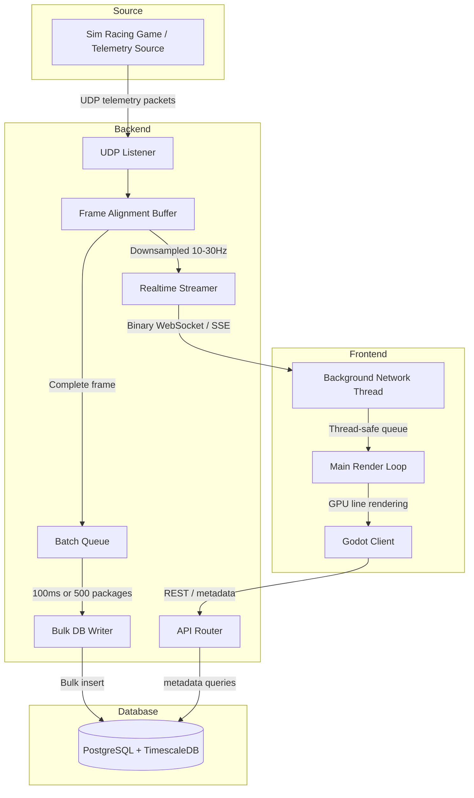

# NewTelemetryEngine Architecture

## 1. Overview

This document describes the full architecture for NewTelemetryEngine, a real-time car telemetry application.

The system is designed to:
- ingest high-frequency telemetry via UDP packets,
- align and batch the telemetry into complete frames,
- store telemetry in a relational + time-series database,
- stream real-time updates to a desktop client,
- render data efficiently with Godot.

## 2. Technology Stack

- **Backend:** Go (Golang)
- **Database:** PostgreSQL + TimescaleDB
- **Frontend / Client:** Godot Engine with C# scripting
- **Ingestion Protocol:** UDP packets
- **Realtime Transport:** WebSocket or Server-Sent Events (SSE) using binary payloads
- **Batching Strategy:** 100ms or 500 packages flush to database
- **Frontend Render Rate:** 10 to 30 FPS

## 3. System Architecture

The system has three main layers:
1. Backend ingestion and processing
2. Database storage and metadata
3. Frontend client rendering and replay

### 3.1 Data Flow Diagram



## 4. Backend Architecture (Go)

The Go backend is the ingestion engine, data aligner, batch processor, and realtime streamer.

### 4.1 UDP Ingestion

- The backend listens on a UDP port.
- Telemetry packets are connectionless and may arrive out of order.
- Each packet is deserialized and appended into an in-memory alignment structure.

### 4.2 Frame Alignment

- Telemetry is grouped by `frame_id` or timestamp.
- A frame is a complete telemetry package for one sample point.
- The system stores partial frames in memory until all expected data arrives.
- If a full package does not arrive within a timeout (for example 50ms), the frame is completed or discarded.

### 4.3 Complete Frame

A complete frame contains:
- `timestamp` or `ts`
- `session_id`
- `frame_id`
- `driver_id`
- dynamic telemetry metrics (speed, rpm, throttle, brake, tyre temps, etc.)

### 4.4 Batching Engine

- A dedicated Go goroutine maintains an in-memory buffer of complete frames.
- The batch flush rules are:
  - flush when the buffer reaches 500 frames, or
  - flush every 100ms.
- This avoids row-by-row writes and preserves database performance.

### 4.5 Bulk Insert

- The backend should use bulk insertion patterns.
- For TimescaleDB, batch INSERT or COPY is recommended.
- If using a TSDB like QuestDB, a line-protocol or binary ingestion stream can be used.
- The batch must preserve the same timestamp for all metrics in a frame.

### 4.6 Realtime Streamer

- The backend downsamples live data to 10-30 FPS before sending to the client.
- The payload is sent as binary, not JSON.
- Protocol choices:
  - `WebSocket` with raw binary frames
  - `SSE` with Base64-encoded binary if pure SSE is required
- The backend should only send the most recent frame per interval.

## 5. Database Architecture

The database layer is hybrid: relational metadata plus a time-series telemetry table.

### 5.1 Why TimescaleDB

- TimescaleDB is PostgreSQL with time-series performance.
- It supports relational schema, foreign keys, and SQL.
- It allows efficient high-frequency writes and time-based partitioning.

### 5.2 Design Goals

- Support multiple games and diverse metrics.
- Keep metadata relational for drivers, games, tracks, and sessions.
- Keep telemetry frames aligned and queryable.
- Avoid EAV anti-pattern explosion while allowing dynamic metrics.

### 5.3 Schema: Metadata Tables

```sql
CREATE TABLE games (
    game_id SERIAL PRIMARY KEY,
    name VARCHAR(160) NOT NULL
);

CREATE TABLE drivers (
    driver_id SERIAL PRIMARY KEY,
    name VARCHAR(160) NOT NULL,
    team VARCHAR(160)
);

CREATE TABLE tracks (
    track_id SERIAL PRIMARY KEY,
    name VARCHAR(160) NOT NULL,
    location VARCHAR(160)
);

CREATE TABLE sessions (
    session_id UUID PRIMARY KEY DEFAULT gen_random_uuid(),
    game_id INT NOT NULL REFERENCES games(game_id),
    track_id INT NOT NULL REFERENCES tracks(track_id),
    start_time TIMESTAMP NOT NULL DEFAULT NOW(),
    end_time TIMESTAMP NULL,
    metadata JSONB NULL
);

CREATE TABLE laps (
    lap_id UUID PRIMARY KEY DEFAULT gen_random_uuid(),
    session_id UUID NOT NULL REFERENCES sessions(session_id),
    driver_id INT NOT NULL REFERENCES drivers(driver_id),
    lap_number INT NOT NULL,
    start_time TIMESTAMP NOT NULL,
    end_time TIMESTAMP NULL,
    duration_ms BIGINT NULL
);
```

### 5.4 Schema: Telemetry Data Table

```sql
CREATE TABLE telemetry_data (
    ts TIMESTAMP NOT NULL,
    session_id UUID NOT NULL REFERENCES sessions(session_id),
    lap_id UUID NOT NULL REFERENCES laps(lap_id),
    driver_id INT NOT NULL REFERENCES drivers(driver_id),
    frame_id BIGINT NOT NULL,
    metrics JSONB NOT NULL,
    PRIMARY KEY (session_id, lap_id, frame_id)
);

SELECT create_hypertable('telemetry_data', 'ts');

CREATE INDEX idx_telemetry_data_metrics ON telemetry_data USING GIN (metrics);
CREATE INDEX idx_telemetry_data_session_ts ON telemetry_data (session_id, ts DESC);
CREATE INDEX idx_telemetry_data_lap_ts ON telemetry_data (lap_id, ts DESC);
```

### 5.5 How the Data is Inserted

1. Create or reuse metadata records for `games`, `drivers`, and `tracks`.
2. When a run starts, insert a `sessions` row and obtain `session_id`.
3. When a driver begins a lap, insert a `laps` row and obtain `lap_id`.
4. Process incoming UDP telemetry packets in Go and align them into complete frames by `frame_id`.
5. For each completed frame, build one `telemetry_data` row including:
   - `ts`
   - `session_id`
   - `lap_id`
   - `driver_id`
   - `frame_id`
   - `metrics` JSONB
6. Flush complete rows in bulk to the DB on either:
   - a 100ms timer, or
   - when the batch reaches 500 frames.

### 5.6 When to Store Redundant Keys

Storing `session_id`, `lap_id`, and `driver_id` in `telemetry_data` is intentional:
- it keeps queries simple,
- it allows direct filtering without extra joins,
- it preserves context when rows are read in isolation.

### 5.5 Frame Reference Strategy

- `ts` is the primary time reference.
- `frame_id` is stored redundantly for exact frame lookups.
- `metrics` is JSONB and can store any game-specific payload.
- Example payload:

```json
{
  "speed": 120.4,
  "rpm": 12750,
  "throttle": 0.82,
  "brake": 0.0,
  "tyre_temp_fl": 88.8,
  "tyre_temp_fr": 89.2
}
```

### 5.6 Querying Specific Metrics

To retrieve only requested metrics:

```sql
SELECT ts,
       frame_id,
       (metrics->>'speed')::FLOAT AS speed,
       (metrics->>'rpm')::INT AS rpm
FROM telemetry_data
WHERE session_id = '...'
ORDER BY ts ASC;
```

### 5.7 How This Supports Multiple Games

- `games` table stores game metadata.
- `sessions` ties a run to a game, driver, track, and metadata.
- `telemetry_data.metrics` stores dynamic metrics per frame.
- The schema remains flexible and relational.

## 6. Backend Data Lifecycle

### 6.1 Session Initialization

- Create a session record when a telemetry run starts.
- Generate a `session_id` UUID.
- Link the session to game, driver, and track.

### 6.2 Packet Ingestion

- UDP packets arrive continuously.
- Each packet is parsed and appended to an alignment buffer keyed by `frame_id`.
- Partial packets are merged until a full frame is ready.

### 6.3 Frame Assembly

- A complete frame has a validated timestamp and all required fields.
- Fields may be dynamic by game.
- The backend may use a timeout to finalize incomplete frames.

### 6.4 Batch Persisting

- Complete frames enter the write queue.
- The write queue flushes in bulk by size or time.
- Bulk insert preserves write throughput and protects the database.

### 6.5 Realtime Delivery

- The backend maintains a separate path for frontend streaming.
- Only the latest frames are forwarded at the configured render rate.
- The backend may downsample or decimate frames before sending.

## 7. Frontend Architecture (Godot)

The frontend is a desktop client built with Godot and C#.

### 7.1 Why Godot

- Lightweight desktop runtime.
- Good support for hardware-accelerated 2D rendering.
- Ideal for rendering thousands of points smoothly.
- Allows use of a background network thread and a main render loop.

### 7.2 Networking Thread

- The Godot client runs network I/O on a background thread.
- The thread consumes SSE or WebSocket binary messages.
- It deserializes payloads into native structs.
- Data is pushed into a thread-safe queue.

### 7.3 Main Render Loop

- The Godot main thread polls the queue during `_Process(delta)`.
- New telemetry frames are pulled from the queue.
- The UI updates are scheduled without blocking networking.

### 7.4 Rendering Strategy

- Use `Line2D` or custom mesh rendering for graphs.
- Avoid expensive UI controls for high-frequency plots.
- Render only visible data points.
- Use downsampling / LTTB-style decimation for historical views.

### 7.5 Historical Data

- For historical replay, the client requests specific metrics via API.
- The backend returns only the selected keys.
- The client can fetch limited ranges to avoid loading too much data at once.

## 8. Protocol and Payload Design

### 8.1 Binary vs JSON

- Binary payloads are required for performance.
- JSON is too slow for high-frequency telemetry.

### 8.2 SSE vs WebSocket

- WebSocket is the natural choice for raw binary.
- SSE is text-based and can work only if binary data is encoded (Base64).
- Recommendation: Use WebSocket for binary streaming.

### 8.3 Frame Rate Controls

- Data source rate: 60+ Hz
- Database write batch: 100ms or 500 frames
- Frontend render rate: 10–30 FPS

## 9. Developer Notes

- Keep the database schema relational for metadata and flexible for metrics.
- Use TimescaleDB hypertables for high-frequency telemetry.
- Use binary streaming and batch writes to preserve performance.
- Use a background network thread in Godot and a thread-safe queue.
- Use redundant `frame_id` plus `timestamp` to identify exact frames.
- Store dynamic metrics in JSONB to support multiple games and varying telemetry.

## 10. Example SQL Schema Summary

```sql
CREATE TABLE games (
    game_id SERIAL PRIMARY KEY,
    name VARCHAR(160) NOT NULL
);

CREATE TABLE drivers (
    driver_id SERIAL PRIMARY KEY,
    name VARCHAR(160) NOT NULL,
    team VARCHAR(160)
);

CREATE TABLE sessions (
    session_id UUID PRIMARY KEY,
    game_id INT NOT NULL REFERENCES games(game_id),
    driver_id INT NOT NULL REFERENCES drivers(driver_id),
    track_name VARCHAR(160),
    start_time TIMESTAMP NOT NULL DEFAULT NOW(),
    end_time TIMESTAMP NULL,
    metadata JSONB NULL
);

CREATE TABLE telemetry_data (
    ts TIMESTAMP NOT NULL,
    session_id UUID NOT NULL REFERENCES sessions(session_id),
    frame_id BIGINT NOT NULL,
    driver_id INT NOT NULL REFERENCES drivers(driver_id),
    metrics JSONB NOT NULL,
    PRIMARY KEY (session_id, frame_id)
);

SELECT create_hypertable('telemetry_data', 'ts');
CREATE INDEX idx_telemetry_data_metrics ON telemetry_data USING GIN (metrics);
CREATE INDEX idx_telemetry_data_session_ts ON telemetry_data (session_id, ts DESC);
```

## 11. Recommended Backend Flow

1. Start UDP listener.
2. Parse and validate incoming telemetry packets.
3. Align packets by `frame_id` and `session_id`.
4. Build complete frames in memory.
5. Send complete frames to the batch writer.
6. Bulk insert batches into TimescaleDB.
7. Publish downsampled realtime frames to Godot via binary WebSocket.
8. Serve metadata and historical queries through a REST API.

## 12. Recommended Frontend Flow

1. Start the Godot application.
2. Open a WebSocket connection to the backend.
3. Receive binary frame updates on a background thread.
4. Enqueue received frames for the main thread.
5. Process queued frames during `_Process(delta)`.
6. Update line graphs and UI controls.
7. Request metadata and historical data through REST when needed.

## 13. Final Notes

- This architecture is tailored to the stack you selected: Go backend, TimescaleDB, Godot frontend.
- The design supports multiple games, drivers, tracks, and dynamic metrics.
- The batch logic and binary streaming ensure the system can handle high throughput.
- The database design keeps relational metadata clean while retaining dynamic telemetry storage.
